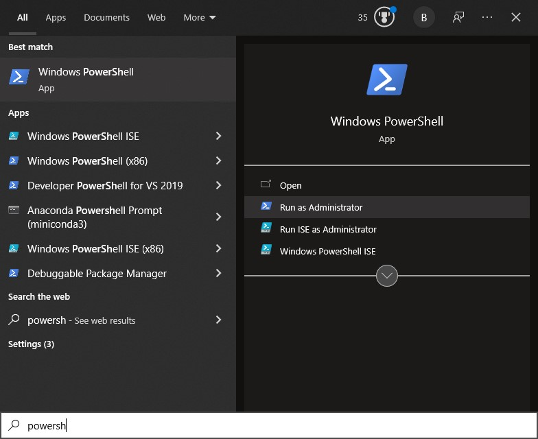
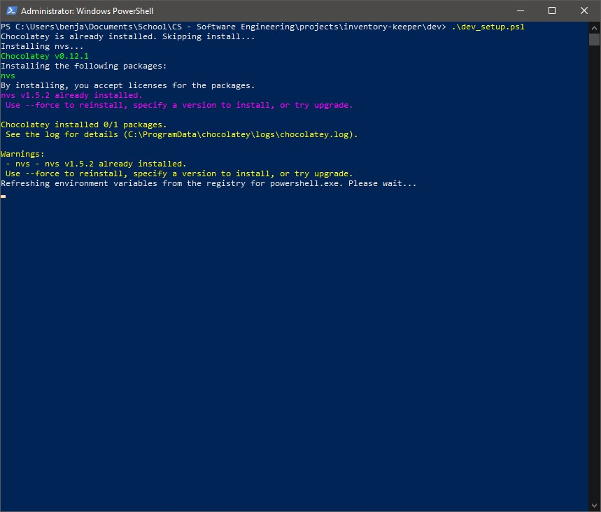

# Setting up your dev environment:
To get started, run the powershell script `dev_setup.ps1` to install all of the pre-requisites for this project.

**IMPORTANT:** You need to run this script in a privledged powershell session while in the `/dev` directory.
This can be done by right-clicking on the PowerShell application in Windows and selecting "Run as Administrator".

Once the script has completed navigate to the root directory of this project and run: `expo start` or `npm start` This will start up a local server.

To view the application you will need to download and install the Expo app on your phone and connect to the same network as your computer.
 - [iOS App](https://apps.apple.com/app/apple-store/id982107779)
 - [Android App](https://play.google.com/store/apps/details?id=host.exp.exponent&referrer=www)

Scan the QR code from the terminal with the Expo app on your phone to view the app.

Now, while editing the project code locally in your editor you should see your changes reflected immediately on your phone.

## Recommendations
 - IDE/Text Editor: [Visual Studio Code](https://code.visualstudio.com/)